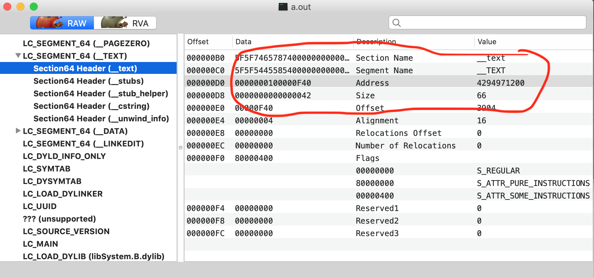

# fishhook 分析 

Mach-O不像XML / YAML / JSON 这样的特殊格式，它只是一个以有意义的数据块分组的二进制字节流。这些块包含元信息，例如：字节顺序，cpu类型，块的大小等。
    
典型的Mach-O文件由三个段组成：
1. `标题`: 包含有关二进制文件的一般信息：字节顺序（魔数），cpu类型，加载命令数量等。
2. `加载命令`: 它是一种目录，描述了段的位置，符号表，动态符号表等。每个加载命令都包含一个元信息，如命令类型，名称，二进制位置等等。
3. `数据`: 通常是目标文件的最大部分。 它包含代码和数据，例如符号表，动态符号表等。
OS X上有两种类型的目标文件：Mach-O文件和通用二进制文件，也就是所谓的Fat文件。 它们之间的区别：Mach-O文件包含一个体系结构（i386，x86_64，arm64等）的目标代码，而Fat二进制文件可能包含多个目标文件，因此包含不同体系结构的对象代码（i386和x86_64，arm和arm64， 等等。）
<p align="center"></p>
我们可以从这一张图来简单的理解一下。
<p align="center"></p>


```
struct mach_header {
    uint32_t    magic;              /* mach magic number identifier */      /*魔数*/
    cpu_type_t    cputype;          /* cpu specifier */                     /*CPU类型*/
    cpu_subtype_t    cpusubtype;    /* machine specifier */                 /*机器类型*/
    uint32_t    filetype;           /* type of file */                      /*文件类型*/
    uint32_t    ncmds;              /* number of load commands */           /*加载指令数*/
    uint32_t    sizeofcmds;         /* the size of all the load commands */ /*所有指令的大小*/
    uint32_t    flags;              /* flags */                             /*标志位*/
};

struct mach_header_64 {
    uint32_t    magic;              /* mach magic number identifier */
    cpu_type_t    cputype;          /* cpu specifier */
    cpu_subtype_t    cpusubtype;    /* machine specifier */
    uint32_t    filetype;           /* type of file */
    uint32_t    ncmds;              /* number of load commands */
    uint32_t    sizeofcmds;         /* the size of all the load commands */
    uint32_t    flags;              /* flags */
    uint32_t    reserved;           /* reserved */
};

```
<p align="center"></p>

```
struct load_command {
    unsigned long cmd;              /* type of load command */             /*加载指令类型*/ 
    unsigned long cmdsize;          /* total size of command in bytes */   /*加载指令大小*/
};
```
```
struct segment_command {            /* for 32-bit architectures */
    unsigned long    cmd;           /* LC_SEGMENT */
    unsigned long    cmdsize;       /* includes sizeof section structs */
    char        segname[16];        /* segment name */                    /*段名 __TEXT, __DATA, __LINKEDIT*/
    unsigned long    vmaddr;        /* memory address of this segment */  /*段虚拟地址*/
    unsigned long    vmsize;        /* memory size of this segment */     /*段大小*/
    unsigned long    fileoff;       /* file offset of this segment */     /**/
    unsigned long    filesize;      /* amount to map from the file */
    vm_prot_t    maxprot;           /* maximum VM protection */
    vm_prot_t    initprot;          /* initial VM protection */
    unsigned long    nsects;        /* number of sections in segment */   /*段的节数*/
    unsigned long    flags;         /* flags */                           /*段的标识位*/    
};

struct segment_command_64 {         /* for 64-bit architectures */
    uint32_t    cmd;                /* LC_SEGMENT_64 */
    uint32_t    cmdsize;            /* includes sizeof section_64 structs */
    char        segname[16];        /* segment name */
    uint64_t    vmaddr;             /* memory address of this segment */
    uint64_t    vmsize;             /* memory size of this segment */
    uint64_t    fileoff;            /* file offset of this segment */
    uint64_t    filesize;           /* amount to map from the file */
    vm_prot_t    maxprot;           /* maximum VM protection */
    vm_prot_t    initprot;          /* initial VM protection */
    uint32_t    nsects;             /* number of sections in segment */
    uint32_t    flags;              /* flags */
};
```

<p align="center"></p>
<p align="center"></p>

```
struct section {                    /* for 32-bit architectures */
    char        sectname[16];       /* name of this section */               /*节的名字*/
    char        segname[16];        /* segment this section goes in */       /*节所在段名*/
    unsigned long    addr;          /* memory address of this section */     /*节所在地址*/
    unsigned long    size;          /* size in bytes of this section */      /*节的大小*/
    unsigned long    offset;        /* file offset of this section */        /*节的文件偏移*/
    unsigned long    align;         /* section alignment (power of 2) */     /*节的对齐*/
    unsigned long    reloff;        /* file offset of relocation entries */  //
    unsigned long    nreloc;        /* number of relocation entries */       //
    unsigned long    flags;         /* flags (section type and attributes)*/ //
    unsigned long    reserved1;     /* reserved */
    unsigned long    reserved2;     /* reserved */
};

struct section_64 {                 /* for 64-bit architectures */
    char        sectname[16];       /* name of this section */
    char        segname[16];        /* segment this section goes in */
    uint64_t    addr;               /* memory address of this section */
    uint64_t    size;               /* size in bytes of this section */
    uint32_t    offset;             /* file offset of this section */
    uint32_t    align;              /* section alignment (power of 2) */
    uint32_t    reloff;             /* file offset of relocation entries */
    uint32_t    nreloc;             /* number of relocation entries */
    uint32_t    flags;              /* flags (section type and attributes)*/
    uint32_t    reserved1;          /* reserved (for offset or index) */
    uint32_t    reserved2;          /* reserved (for count or sizeof) */
    uint32_t    reserved3;          /* reserved */
};
```

<p align="center"></p>


## 那么我们如何在 Mach-O 文件里找到系统的函数地址呢？或者说 Mach-O 文件是如何链接外部函数的呢？

我们程序的底层都是汇编，汇编代码都是写死的内存地址，并且保存在__TEXT段。我们该怎么找呢？而且系统的动态库在内存里面的地址是不固定的，每次启动程序的时候地址都是随机的。 苹果为了能在 Mach-O 文件中访问外部函数，采用了一个技术，叫做PIC（位置代码独立）技术。当你的应用程序想要调用 Mach-O 文件外部的函数的时候，或者说如果 Mach-O 内部需要调用系统的库函数时，Mach-O 文件会：
1. 先在 Mach-O 文件的 _DATA 段中建立一个指针（空指针），这个指针变量指向外部函数。
2. 然后DYLD 会动态的进行绑定，将 Mach-O 中的 _DATA 段中的指针，指向外部函数。

`注： 对于非懒加载符号表，DYLD会立刻马上去链接动态库
    对于懒加载符号表，DYLD会在第一次执行代码的时候去动态的链接动态库`
所以说，C的底层也有动态的表现。C在内部函数的时候是静态的，在编译后，函数的内存地址就确定了。但是，外部的函数是不能确定的，也就是说C的底层也有动态的。fishhook 之所以能 hook C函数，是利用了 Mach-O 文件的 PIC 技术特点。也就造就了静态语言C也有动态的部分，通过 DYLD 进行动态绑定的时候做了手脚。
我们经常说符号，其实 _DATA 段中建立的指针就是符号。fishhook的原理其实就是，将指向`系统方法`（即外部函数）的符号`重新进行绑定指向内部的函数`。这样就把系统方法与自己定义的方法进行了交换。这也就是为什么C的内部函数修改不了，自定义的函数修改不了，只能修改 Mach-O 外部的函数。

接下来我们以 NSLog 为例，看 fishhook 是如何通过修改懒加载和非懒加载两个表的指针达到C函数HOOK的目的。NSLog是系统函数所以是在懒加载表中的。那么，我们如何找到 NSLog 的符号表呢？公式如下：
**`NSLog 懒加载符号表在内存中的地址 = Mach-O 在内存中的偏移地址 + NSLog懒加载符号表在Mach-O的偏移地址`**

1. `ASLR` 是 Address Space Layout Randomization 的缩写，这个概念并非苹果原创。由于 `vmaddr` (虚拟地址) 是DYLD链接的时候写入 Mach-O 文件的，对于一个程序来说是静态不变的，因此给黑客攻击带来了便利，iOS 4.3 以后引入了 ASLR，给每个镜像在 vmaddr 的基础上再加一个随机的偏移量 `slide`，因此每段数据的真实的虚拟地址是 vmaddr + slide。获取这个slide的方式是调用`dlfcn`库的: `_dyld_get_image_vmaddr_slide(i)`, 获取镜像的起始位置也要调用`dlfcn`库的:   `_dyld_get_image_header(i)`
2. 

## 两个重要的结构体和接口

```
struct rebinding {
    const char *name;               // 需要Hook的函数名称
    void *replacement;              // 新函数的函数指针（地址）
    void **replaced;                // 原函数地址的指针（用来保存原函数）
};
```

```
struct rebindings_entry {
    struct rebinding *rebindings;   // Hook信息(因为可以同时Hook多个函数)
    size_t rebindings_nel;          // Hook数量
    struct rebindings_entry *next;  // 下一个Hook 入口
};
static struct rebindings_entry *_rebindings_head;
```
其中值得注意的是 `rebinding_entry` 在`fishhook.c`文件中被定义为静态变量，只在它的源文件中可以访问。
这样可以通过判断 _rebindings_head->next 的值来判断是否为第一次调用，然后使用 `_dyld_register_func_for_add_image` 将 `_rebind_symbols_for_image` 注册为回调
```
int rebind_symbols(struct rebinding rebindings[], size_t rebindings_nel);
```
其中：
`rebindings`: 存放`rebingding`结构体的数组，fishhook可以同时交换多个函数。

`rebindings_nel`:  存放 `rebingdings`数组的长度。


在 dyld 加载镜像时，会执行注册过的回调函数；当然，我们也可以使用下面的方法注册自定义的回调函数，同时也会为所有已经加载的镜像执行回调：
```
extern void _dyld_register_func_for_add_image(
    void (*func)(const struct mach_header* mh, intptr_t vmaddr_slide)
);
```

对于每一个已经存在的镜像，当它被动态链接时，都会执行回调 `void (*func)(const struct mach_header* mh, intptr_t vmaddr_slide)`，传入文件的 mach_header 以及一个虚拟内存地址 intptr_t。


这部分的代码主要功能是从镜像中查找 `linkedit_segment` , `symtab_command` 和 `dysymtab_command`。 在开始查找之前，要先跳过 `mach_header_t`长度的位置，也就是跳过这个镜像的头(header)，然后将当前指针强转成 `segment_command_t`(这个segment_command_t就是segment_command_64或者segment_command)，通过对比 cmd 的值，来找到需要的 segment_command_t。
在查找了几个关键的 segment 之后，我们可以根据几个 segment 获取对应表的内存地址：

在 `linkedit_segment` 结构体中获得其虚拟地址以及文件偏移量，然后通过一下公式来计算当前 __LINKEDIT 段的位置：

`slide + vmaffr - fileoff`

该函数的实现的核心内容就是将符号表中的 `symbol_name` 与 `rebinding`结构题中的名字进行比较，如果出现了匹配，就会将原函数的实现传入 origian_open 函数指针的地址，并使用新的函数实现 new_open 代替原实现。


DYLD通过更新MachO文件中二进制__DATA段的特定部分中的指针来绑定惰性和非惰性符号。Fishhook通过确定传递给重新绑定符号的每个符号名称的更新位置，然后写出相应的替换，重新绑定这些符号。

对于给定的镜像，__DATA可能包含与动态符号绑定相关的两个部分：`__nl_symbol_ptr`和 `__la_symbol_ptr`。__nl_symbol_ptr是指向非延迟绑定数据的指针数组（这些指针在加载库时绑定），而__la_symbol_ptr是指向导入函数的指针数组，导入函数通常在第一次调用该符号时由名为dyld_stub_binder的例程填充（也可以告诉DYLD在启动时绑定这些指针)。为了找到对应于这些部分中某个特定位置的符号的名称，我们必须跳过几个间接层。对于这两个相关部分，section header提供了一个偏移量（在reserved1字段中），这个偏移量到所谓的`间接符号表`。间接符号表位于二进制文件的__LINKEDIT段中，它只是`符号表`（也在__LINKEDIT中）的索引数组，其顺序与非惰性和惰性符号段中指针的顺序相同。因此，给定结构节__nl_symbol_ptr，该节第一个地址的符号表中的对应索引是间接的`_symbol_table[nl_symbol_ptr->reserved1]`。符号表本身是一个结构nlist数组，每个nlist都包含一个到字符串表的索引，该表存储了实际符号名。因此，对于每个指针，我们可以找到相应的符号，然后找到相应的字符串来与请求的符号名进行比较，如果匹配，我们将用替换来替换节中的指针。

<p align="center"></p>
