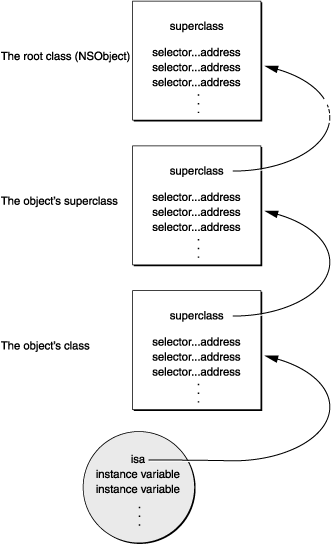

`Method swizzling`用于改变一个已经存在的 `selector`的实现。这项技术使得在运行时通过改变 `selector` 在类的消息分发列表中的映射从而改变方法的掉用成为可能。

例如：我们想要在一款 iOS app 中追踪每一个视图控制器被用户呈现了几次： 这可以通过在每个视图控制器的 `viewDidAppear:` 方法中添加追踪代码来实现，但这样会大量重复的样板代码。继承是另一种可行的方式，但是这要求所有被继承的视图控制器如`UIViewController`, `UITableViewController`, `UINavigationController` 都在 `viewDidAppear`：实现追踪代码，这同样会造成很多重复代码。 幸运的是，这里有另外一种可行的方式：从 `category` 实现 `Method Swizzling` 。下面是实现方式：


```
#import <objc/runtime.h>

@implementation UIViewController (Tracking)

+ (void)load {
    static dispatch_once_t onceToken;
    dispatch_once(&onceToken, ^{
        Class class = [self class];

        SEL originalSelector = @selector(viewWillAppear:);
        SEL swizzledSelector = @selector(xxx_viewWillAppear:);

        Method originalMethod = class_getInstanceMethod(class, originalSelector);
        Method swizzledMethod = class_getInstanceMethod(class, swizzledSelector);

        // When swizzling a class method, use the following:
        // Class class = object_getClass((id)self);
        // ...
        // Method originalMethod = class_getClassMethod(class, originalSelector);
        // Method swizzledMethod = class_getClassMethod(class, swizzledSelector);

        BOOL didAddMethod = class_addMethod(class,
                                            originalSelector,
                                            method_getImplementation(swizzledMethod),
                                            method_getTypeEncoding(swizzledMethod));

        if (didAddMethod) {
            class_replaceMethod(class,
                                swizzledSelector,
                                method_getImplementation(originalMethod),
                                method_getTypeEncoding(originalMethod));
        } else {
            method_exchangeImplementations(originalMethod, swizzledMethod);
        }
    });
}

#pragma mark - Method Swizzling
- (void)xxx_viewWillAppear:(BOOL)animated {
    [self xxx_viewWillAppear:animated];
    NSLog(@"viewWillAppear: %@", self);
}

@end

```


1. 只在 +load 中执行 swizzling 才是安全的。

2. 被 hook 的方法必须是当前类自身的方法，如果把继承来的 IMP copy 到自身上面会存在问题。父类的方法应该在调用的时候使用，而不是 swizzling 的时候 copy 到子类。

3. 被 Swizzled 的方法如果依赖与 cmd ，hook 之后 cmd 发送了变化，就会有问题(一般你 hook 的是系统类，也不知道系统用没用 cmd 这个参数)。

4. 命名如果冲突导致之前 hook 的失效 或者是循环调用。

上述问题中第一条和第四条说的是通常的 MethodSwizzling 是在分类里面实现的, 而分类的 Method 是被Runtime 加载的时候追加到类的 MethodList ，如果不是在 +load 是执行的 Swizzling 一旦出现重名，那么 SEL 和 IMP 不匹配致 hook 的结果是循环调用。

第三条是一个不容易被发现的问题。
我们都知道 Objective-C Method 都会有两个隐含的参数 self, cmd，有的时候开发者在使用关联属性的适合可能懒得声明 (void *) 的 key，直接使用 cmd 变量 objc_setAssociatedObject(self, _cmd, xx, 0); 这会导致对当前IMP对 cmd 的依赖。

一旦此方法被 Swizzling，那么方法的 cmd 势必会发生变化，出现了 bug 之后想必你一定找不到，等你找到之后心里一定会问候那位 Swizzling 你的方法的开发者祖宗十八代安好的，再者如果你 Swizzling 的是系统的方法恰好系统的方法内部用到了 cmd ...~_~（此处后背惊起一阵冷汗）。


```
// 获取类的类名
const char *class_getName( Class cls );
// 获取类的父类
Class clas_getSuperClass( Class cls );
// 判断给定的Class 是否是一个元类
BOOL class_isMetaClass( Class cls );
```

```
// 获取实例变量大小
size_t class_getInstanceSize( Class cls );
// 获取类中指定名称实例成员变量的信息
Ivar class_getInstanceVariable( Class cls, const char *name ); 
// 获取类成员变量的信息
Ivar class_getClassVariable( Class cls, const char *name);
// 获取整个成员变量列表
Ivar *class_copyIvarList( Class cls, unsigned int *outCout);
```

```
// 获取指定的属性
objc_property_t class_getProperty( Class cls, const char *name);
// 获取属性列表
objc_property_t class_copyPropertyList( Class cls, unsigned int *outCount);
// 为类添加属性
BOOL class_addProperty( Class cls, const char *name, const )
```

```
struct objc_class {
    Class isa;                              // 元类
    Class super_class;                      // 父类
    const char *name;                       // 类名
    long version;                           // 类的版本信息，默认为0
    long info;                              // 类信息，供运行期使用的一些位标识
    long instance_size;                     // 该类的实例变量大小
    struct objc_ivar_list *ivars;           // 该类的成员变量链表
    struct objc_method_list **methodLists;  // 方法定义的链表
    struct objc_cache *cache;               // 方法缓存
    struct objc_protocol_list *protocols;   // 协议链表
};
```

```
struct objc_object {
    Class isa;
};
typedef struct objc_object *id;
```


```
typedef struct objc_ivar *Ivar;
struct objc_ivar {
    char *ivar_name;                        // 变量名
    char *ivar_type;                        // 变量类型
    int ivar_offset;                        // 基地址偏移字节
    int space;
}
```


```
// 返回给定对象的类名
const char *object_getClassName( id obj );
// 返回对象的类
Class object_getClass( id obj );
// 设置对象的类
Class object_setClass( id obj, Class cls );
```

### `SEL`
&emsp;`SEL`又叫做选择器，是表示一个方法的`selector`的指针，其定义如下：
```
    typedef struct objc_selector *SEL;
```
&emsp;`objc_selector`结构体的详细定义并没有暴露出来，但是我们知道方法的`selector`用于表示运行时方法的名字。`Objective-C`在编译的时候，会根据每一个方法的名字，参数序列，生成一个唯一的标识。
两个类之间，不管它们是父类与子类的关系，还是没有这种关系，只要方法名相同，这两个方法`SEL`就是一样的。所以`Objective-C同一个类不能存在两个同名的方法，即使参数类型不同也不行`。当然啦，不同的类可以拥有相同的`selector`，不同类的实例对象执行相同的`selector`时，会在各自的方法列表中，根据`selector`去寻找对应的`IMP`。

```
// C++ 风格
-(void)setWidth:(int)width;
-(void)setWidth:(double)width;

// Objective-C 风格
-(void)setWidthWidthIntValue:(int)width;
-(void)setWidthWidthDoubleValue: (double)width;
```
#### 获取`selector`的方法
```
1. sel_registerName函数
2. Objective-C编译器提供的@selector()
3. NSSelectorFromString()方法
```

#### `SEL`的相关方法
```
1. const char * sel_getName(SEL sel);                                                       // 获得选择器指定的方法的名字
2. BOOL sel_isEqual(SEL lhs, SEL rhs);                                                      // 比较两个选择器是否相同
3. SEL sel_registerName(const char *str);                                                   // 使用Objective-C Runtime系统注册方法，找到方法名对应的选择器，并返回该选择器值。
```
&emsp;实际上 `SEL`就是`const char *`,我们看到`sel_getName`和`sel_isEqual`的实现就能发现，其中`sel_getName`的实现方式就是直接把`SEL`转换成了`const char*`：
```
const char *sel_getName(SEL sel) {
    return sel ? (const char *)sel : "<null selector>";
}

BOOL sel_isEqual(SEL lhs, SEL rhs){
    return (lhs == rhs) ? YES : NO;
}
```
#### `sel_registerName`做了什么事情
`提醒⏰：`  这不是正确的代码，为了方便理解我删去了加锁的代码。
```
static SEL __sel_registerName(const char *name, int lock, int copy) {
    SEL result = 0;
    if(!name) return (SEL)0;
    
    result = _objc_search_builtins(name);
    if (result) return result;
        
    if (_objc_selectors) {
        result = __objc_sel_set_get(_objc_selectors, (SEL)name);
    }
    if (result) return result;

    // No match. Insert.
    if (!_objc_selectors) {
        _objc_selectors = __objc_sel_set_create(SelrefCount);
    }

    if (!result) {
        result = (SEL)(copy ? _strdup_internal(name) : name);
        __objc_sel_set_add(_objc_selectors, result);
    }
    return result;
}
```
&emsp; 基本上就是在`selector`的`set`中查询选择器，如果找到了就返回查询到的，如果没有找到就插入一个新的选择器到这个`set`中。
### `IMP`
&emsp;`IMP`实际上就是一个函数指针，指向方法实现的首地址。其定义如下：
```
id (*IMP)(id, SEL, ...)
```
&emsp;第一个参数就是`指向self的指针(如果是实例方法，则是实例的内存地址，如果是类方法，则是类的内存地址)`，第二个参数是方法选择器，接下来的是方法的实际参数列表。通过取得`IMP`，我们可以跳过`Runtime`的消息传递机制，直接执行`IMP`指向的函数实现，这样省去了`Runtime`消息传递过程中的一系列查找炒作，会比直接向对象发送消息高效一些。

### `Method`
```
typedef struct objc_method *Method;
struct objc_method {
    SEL method_name;                        // 方法名
    char *method_types;
    IMP method_imp;                         // 方法实现
}
```

```
struct objc_method_description { 
    SEL name; 
    char *types; 
};
```
&emsp;我们可以看到该结构体中包含了一个`SEL`和`IMP`，实际上相当于在`SEL`和`IMP`之间做了一个映射。有了`SEL`，我们便可以找到对应得`IMP`，从而调用方法的实现代码。
#### `Method`的相关方法
```
1. id method_invoke( id receiver, Method m, ... );                                          // 调用指定方法的实现
2. SEL method_getName( Method m );                                                          // 获取方法名
3. IMP method_getImplementation( Method m );                                                // 返回方法实现
4. const char* method_getTypeEncoding( Method m );                                          // 获取描述方法参数和返回值类型的字符串
5. char *method_copyReturnType( Method m );                                                 // 获取方法的返回值类型的字符串
6. char *method_copyArgumentType( Method m, unsigned int index );                           // 获取方法的制定位置参数的类型字符串
7. void method_getReturnType( Method m, char *dst, size_t dst_len);                         // 通过引用 返回方法的返回值类型的字符串
8. unsigned int method_getNumberOfArguments( Method m );                                    // 返回方法的参数个数
9. void method_getArgumentType( Method m, unsigned int index, char *dst, size_t dst_len);   // 通过引用 返回方法的制指定位置参数的类型字符串
10. struct objc_method_description *method_getDescription( Method m );                      // 返回指定方法的方法描述结构体
11. IMP method_setImplementation( Method m, IMP imp );                                      // 设置方法的实现
12. void method_exchangeImplementations( Method m1, Method m2 );                            // 交换两个方法的实现
```
`提醒⏰：` 一个小规律，`get`出来的值不用`free()`， `copy`出来的值一定要`free()。`

#### 方法调用流程
在`Objective-C`中，消息直到运行时才绑定到方法实现上。编译器会将消息表达式`[receiver message]`转化为一个消息函数的调用，即`objc_msgSend`。这个函数将`消息接收者`和`方法名`作为其`前两个参数`，如以下所示：
```
objc_msgSend(receiver, selector)                    // 该消息没有其他参数
objc_msgSend(receiver, selector, arg1, arg2, ...)   // 如果消息中还有其它参数
```
这个函数完成了`动态绑定`的所有事情：

1. 首先它找到`selector`对应的方法实现。因为同一个方法可能在不同的类中有不同的实现，所以我们需要依赖于接收者的类来找到的确切的实现。
2. 它`调用方法实现`，并将`接收者对象`及方法的所有参数传给它。
3. 最后，它将实现返回的值作为它自己的返回值。

消息的关键在于我们前面章节讨论过的结构体`objc_class`，这个结构体有两个字段是我们在分发消息的关注的：

1. 指向父类的指针
2. 一个类的方法分发表，即`methodLists`。
当我们创建一个新对象时，先为其分配内存，并初始化其成员变量。其中`isa`指针也会被初始化，`让对象可以访问类及类的继承体系`。

下图演示了这样一个消息的基本框架：

 

&emsp;当消息发送给一个对象时，`objc_msgSend`通过对象的`isa`指针获取到`类的结构体`，然后在`方法分发表`里面查找方法的`selector`。如果没有找到`selector`，则通过`类的结构体`中的指向父类的指针找到其父类，并在父类的`方法分发表`里面查找方法的`selector`。依此，会一直沿着类的继承体系到达`NSObject`类。一旦定位到`selector`，函数会就获取到了`实现(IMP)`的入口点，并传入相应的参数来执行方法的具体实现。如果最后没有定位到`selector`，则会进入`消息转发流程`，这个我们在后面讨论。

为了加速消息的处理，运行时系统`缓存`使用过的`selector`及`对应的方法的地址`。
#### 隐含参数
`objc_msgSend`有两个隐藏参数：
1. `消息接收对象(receiver)`
2. 方法的`选择器(selector)`
&emsp;这两个参数为方法的`实现(IMP)`提供了调用者的信息。之所以说是隐藏的，是因为它们在定义方法的源代码中没有声明。它们是在编译期被插入实现代码的。虽然这些参数没有显示声明，但在代码中仍然可以引用它们。我们可以使用`self`来引用接收者对象，使用`_cmd`来引用选择器。如下代码所示：
```
- strange{
    id  target = getTheReceiver();
    SEL method = getTheMethod();
    if ( target == self || method == _cmd )
        return nil;
    return [target performSelector:method];
}
```
&emsp;`self`的用处不必多言，我们经常要使用，而`_cmd`的用处相对而言就小很多多了，一般都是用来获取当前方法名(但如果只是要打印出来方法名，可以使用 `__PRETTY_FUNCTION__`)。
```
NSLog(@"<%@:%@:%d>", NSStringFromClass([self class]), NSStringFromSelector(_cmd), __LINE__);
NSLog(@"%s", __PRETTY_FUNCTION__); 
```


### `Super`
&emsp; 在`Objective-C`中，如果我们需要在类的方法中调用父类的方法，通常都会用到`super`
```
-(void)viewDidLoad {
    [super viewDidLoad];
    // Do something 
}
```
&emsp;首先我们要知道的是`super`与`self`不同，`self`是类的一个隐藏参数，每个方法的实现的第一个参数都是`self`。然而`super`并不是隐藏参数，它实际上只是一个`"编译器标示符"`，它负责告诉编译器，当调用`viewDidLoad`方法时，去调用父类的方法，而不是本类中的方法。而它实际上与`self`指向的是相同的消息接受者。
```
struct objc_super {
    id receiver;
    Class superClass;
}
```
&emsp; 当我们用`super`来接收消息时，编译器会生成一个`objc_super`结构题。就上面的例子而言，这个结构体的`receiver`就是`MyViewController`对象，与`self`相同；`superClass`指向`MyViewController`的父类`UIViewController`。接下来，发送消息的时候，不是调用`objc_msgSend函数`，而是调用`objc_msgSendSuper函数`
```
id objc_msgSendSuper(struct objc_super *super, SEL op, ... );
```
&emsp;该函数的实际操作是： 从`objc_super`结构题体向的`superClass`的方法列表开始查找`viewDidLoad`的`selector`，找到之后`objc_super->receiver`去调用这个`selector`。
